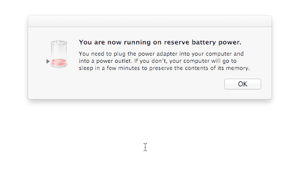
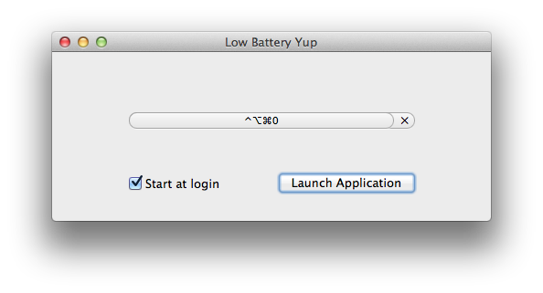

Low Battery Yup
===============

When a Mac laptop is low on battery, Mac OS X will kindly show an alert dialog
to make the user aware of this. Mac OS X will unkindly pop that dialog on top of
all other windows _without_ making it the key window, thus rendering it
impossible to dismiss using the keyboard alone. Instead, users must mouse to the
window in order to make it go away.

Low Battery Yup is a daemon that will click the low battery alert dialog's OK
button when a keyboard shortcut is pressed, eliminating the need to use the
mouse. This allows you to say “Yup, thanks for letting me know. You can go away
now, just don't force me to reach for the mouse”.

The global shortcut that activates the pressing of the OK button is
configurable.

## Demo

## Configuration Screenshot

## Install
A copy of the application bundle is available on the [releases][1] page. Unzip
it and drag it to your `/Applications` folder.

## Uninstall
Open Low Battery Yup. If the button reads “Quit Application”, click it. Uncheck
the “Start at login” check box. Quit and trash Low Battery Yup and its
`~/Library/Preferences` plist file.

## Dev Info
Developed in Xcode 4.5.2 on Mac OS X 10.8.

## License
Copyright © 2016 Teddy Wing. Licensed under the GNU GPLv3+ (see the included
COPYING file).

[1]: https://github.com/teddywing/Low-Battery-Yup/releases
